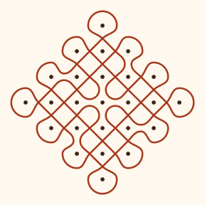

<p align="center"></p>

# SOLVIX – Kolam AI

**Identify the design principles behind a kolam and recreate it digitally.**
Built for Smart India Hackathon problem statement **SIH25107**: *"Develop computer programs (in any
language, preferably Python) to identify the design principles behind the Kolam designs and
recreate the kolams."*

A pulli kolam is a grid of dots (*pulli*) with a line (*neli*) that loops around every dot without
touching it. Between two neighbouring dots the line either **crosses** itself or **turns**, as if it
bounced off a mirror. The dot grid plus that choice at every gap fully describes the kolam
(the mirror-curve model of Gerdes, 1989). SOLVIX reads exactly that from a photo.

## What it does

| | |
| --- | --- |
| **Analyze** | Upload a photo or scan. OpenCV finds the dots, fits a (rotation- and perspective-tolerant) lattice, and reads the ink between every pair of dots as a crossing, a turn-back or a join. |
| **Design principles** | Dot grid and orientation, dots per row (e.g. `1-3-5-3-1`), crossings/turns/joins, number of loops (1 = sikku, one continuous line), symmetry of the design and of the drawing, and a confidence score. |
| **Recreate** | The kolam is redrawn as clean vector strands on top of your photo. Fix missed dots by hand (click, drag, undo) and recreate from your corrections. |
| **Generate** | Square or diamond dot grids, with a one-click transform that joins all loops into a single line while keeping the design symmetric. |
| **Share** | Export SVG, PNG, or the open `.kolam.json` format, and save kolams in the browser. |
| **Learn** | A step-by-step walkthrough of dots → symmetry → strands → completion for the current design. |

No sample photo at hand? Press **Try a sample** in the analyzer.

## Run it

### One command (Docker)

```bash
docker build -t solvix-kolam .
docker run -p 8000:8000 solvix-kolam
```

Open http://localhost:8000. The container serves the web app and the API (`/api/...`) together.

### Local development

Requires Node.js 20+ and Python 3.10+.

```bash
# terminal 1 – API on :8000
cd backend
pip install -r requirements.txt
python main.py

# terminal 2 – web app on :3000 (proxies /api to :8000)
npm install
npm run dev
```

### Checks

```bash
npm run typecheck && npm test && npm run build
cd backend && pip install -r requirements-dev.txt && python -m pytest -q
```

CI runs the same checks and a Docker build on every push (`.github/workflows/ci.yml`).

## Deploy

Build with `--build-arg SITE_URL=https://your-domain` (or `SITE_URL=… npm run build`) so shared
links show the preview card with an absolute image URL.

The Docker image runs anywhere that runs containers (Render, Railway, Fly.io, Google Cloud Run,
Hugging Face Spaces, a VPS). It listens on `$PORT` (default 8000) and has a health check at
`/api/health`.

To host the frontend separately (for example on a static host), build it with
`VITE_API_BASE_URL=https://your-api.example.com npm run build`, and start the API with
`CORS_ORIGINS=https://your-frontend.example.com`. See `.env.example`.

## API

`POST /api/analyze` (multipart form)

| field | |
| --- | --- |
| `file` | PNG, JPEG or WebP, up to 8 MB |
| `preset` | `balanced` (default), `clean-scan`, `phone-photo`, `noisy-background` |
| `deskew` | `true` (default): straighten a photographed sheet. The corrected image is returned as `image` |
| `dots` | optional JSON list of `{x, y}` (0–1): use these dots instead of detecting them |

The response includes `dots`, `lattice` (grid size, origin and axes in image coordinates),
`design` (see below), `symmetry` (drawing symmetry scores), `confidence` and `message`.

## The `.kolam.json` format

```json
{
  "format": "kolam", "version": 1, "createdAt": "2026-01-01T00:00:00.000Z",
  "design": {
    "rows": 3, "cols": 3,
    "mask": ["010", "111", "010"],
    "h": ["..", "xx", ".."],
    "v": [".x.", ".x."]
  },
  "dots": [{ "x": 0.5, "y": 0.2 }],
  "lattice": null
}
```

`mask[j][i]` is `1` where a dot sits. `h[j][i]` describes the gap between dots `(i, j)` and
`(i+1, j)`, and `v[j][i]` the gap between `(i, j)` and `(i, j+1)`. Each gap is `x` (strands cross),
`p` (strands turn back around each dot), `j` (strands join the two dots) or `.` (no gap because a
dot is missing).

## Project layout

```text
src/utils/kolamLogic.ts     mirror-curve engine: tracing, symmetry, single-line transform, SVG
src/components/             analyzer, generator, walkthrough and page sections
src/lib/                    API client and .kolam.json helpers
backend/detection.py        dot detection (OpenCV)
backend/principles.py       lattice fit, crossing/turn reading, symmetry
backend/main.py             FastAPI app; also serves the built frontend
```

## Feedback

Tried it on your own kolam? Please [open an issue](https://github.com/Rhytam23/kolam-2/issues)
with the photo (or its `.kolam.json`) and what SOLVIX got right or wrong.

## References

- G. Siromoney, R. Siromoney, K. Krithivasan. *Array grammars and kolam*. Computer Graphics and Image Processing 3(1), 1974.
- P. Gerdes. *Reconstruction and extension of lost symmetries: examples from the Tamil of South India*. Computers & Mathematics with Applications 17(4–6), 1989.
- M. Ascher. *The Kolam Tradition*. American Scientist 90(1), 2002.
- *KolamNetV2: efficient attention-based deep learning network for Tamil heritage art-kolam classification*. npj Heritage Science, 2024.

## License

MIT, see [LICENSE](LICENSE).
